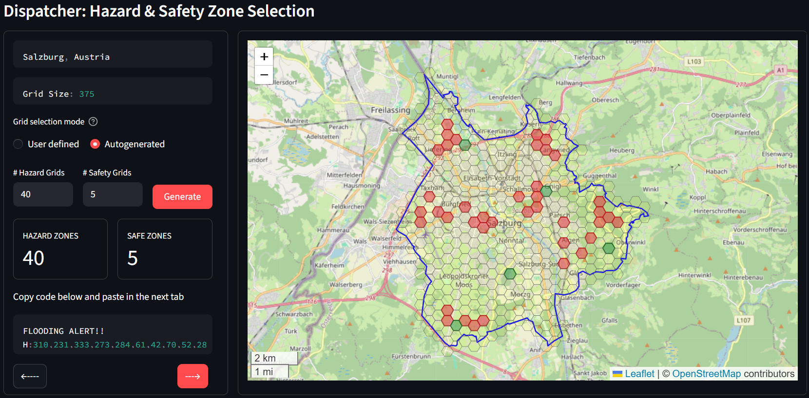
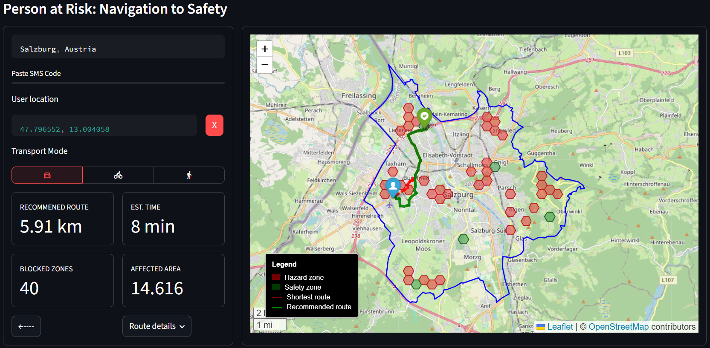

# SafeSMS

**SafeSMS** is a Streamlit prototype for low-bandwidth emergency navigation. It explores how hazard and safety information could be shared through compact SMS-style codes when internet connectivity is unreliable, slow, or unavailable.

The core idea is simple: prepare the heavy map data ahead of time, then send only the emergency update when conditions change.



## Why It Matters

During floods, wildfires, storms, landslides, conflict situations, and other emergencies, people often need very local information: which roads are blocked, which areas are unsafe, and where they can move to safety.

Modern emergency tools often assume that mobile data, live web maps, and app-based communication will keep working. SafeSMS asks what can still be done when those channels are unreliable, but basic text messaging may still be available.

SafeSMS is a prototype for a possible mobile app where essential layers are downloaded before an emergency:

- City boundary
- Grid system
- Road network
- Basemap

When an emergency happens, a dispatcher or trusted local authority can send only the latest grid IDs for affected and safe areas. The recipient pastes that code into the app, selects their location and transport mode, and receives a recommended route toward safety.

## How It Works

SafeSMS has two main roles.

### Dispatcher / Sender

The sender would typically be a city emergency response service, dispatcher, humanitarian coordinator, local authority, or trusted local organization.

They can:

- Select or prepare a city area.
- Generate a hexagonal grid over the area.
- Mark affected/hazard grids and safety grids.
- Autogenerate demo hazard and safety zones.
- Encode the selected grid IDs into a compact SMS message.
- Send the SMS code to people who need a local safety update.

### Person at Risk / Recipient

The recipient can:

- Paste the received SMS code into the app.
- Decode affected and safe grid IDs.
- View hazard and safety zones on the map.
- Select their current location.
- Choose a transport mode: driving, cycling, or walking.
- Compare the shortest route with a recommended route that avoids affected grids where possible.
- View distance and estimated travel time for the selected mode.



## Features

- Interactive Streamlit page flow.
- City boundary and road network retrieval with OSMnx.
- Hexagonal grid generation with GeoPandas and Shapely.
- Manual or autogenerated affected/safety grid selection.
- Compact SMS-style encoding and decoding of grid IDs.
- Recipient-side route calculation to the closest safety grid.
- Transport-mode-aware routing based on OSM road classes.
- Route distance and estimated travel-time metrics.
- Folium map layers, markers, route styling, legends, and street tooltips.

## Tech Stack

- [Streamlit](https://streamlit.io/) for the app interface.
- [Folium](https://python-visualization.github.io/folium/latest/) and `streamlit-folium` for interactive maps.
- [OSMnx](https://osmnx.readthedocs.io/) for OpenStreetMap road networks.
- [GeoPandas](https://geopandas.org/) and [Shapely](https://shapely.readthedocs.io/) for spatial data processing.
- [NetworkX](https://networkx.org/) for route calculations.

## Project Structure

```text
SafeSMS_test/
|-- app.py
|-- data/
|   |-- sender.png
|   `-- reciever.png
|-- utils/
|   |-- description.py
|   |-- mapping.py
|   |-- routing.py
|   |-- sms_code.py
|   `-- vector.py
|-- requirements.txt
`-- README.md
```

## Run Locally

Create and activate an environment, then install the dependencies:

```bash
pip install -r requirements.txt
```

Run the app:

```bash
streamlit run app.py
```

## Deployment Notes

This project is designed to deploy on Streamlit Cloud using `requirements.txt`.

The screenshot assets in `data/` are referenced with paths resolved from `app.py`, so they work across Windows local development and Linux-based cloud deployment.

## Status

SafeSMS is an early-stage prototype and proof of concept. It is not a production emergency response system, but it demonstrates a practical direction for resilient, low-bandwidth spatial communication during crisis situations.

## Authors

Created by:

- [Jedidiah Chibinga](https://www.linkedin.com/in/jedidiah-chibinga)
- [Timotej Gabrijan](#)
- [Manuel Kreitmair](#)
